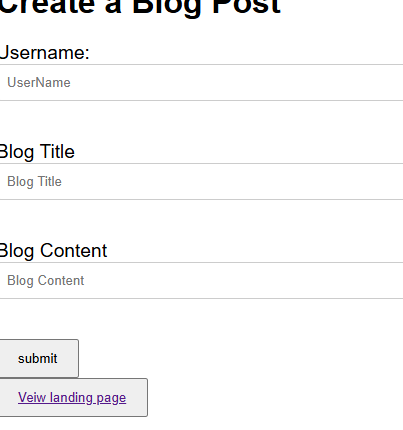

# Commentary1

## Summary of Application
This application is a personal blog where the user input his/her first and last name, title of the blog, and content. When the the user inputs their information they are brought to another page with the data they entered displayed. The application also has a toggle button switching backgrounds colors. Some of the challeneges I faced creating this app was accessing the local storage and rendering the data to the next page. With practice and consistency this page will look aswome when I attempt to create it again!

### To Application

#### Resources
Thank you to my collegues at UNCC bootcamp that answered any questions I had when creating this project. Thank you to my Instructors Sal and Dan for explaining the content in a way that was easy to comprehend. Lastly, thank you to my TA Sasha for helping me out during office.  